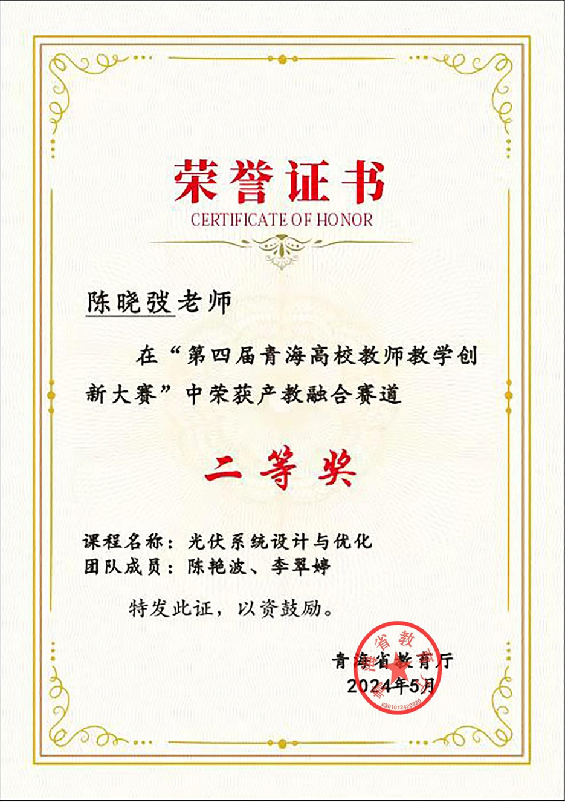

### 获奖概述

青海高校教师教学创新大赛旨在鼓励教师探索新型教学模式、提升教学创新能力。  
学院教师团队参赛项目《光伏系统设计与优化》荣获 **省部级教学创新成果奖**，  
项目突出新能源课程的系统化设计与仿真教学特色，展示了“产学研结合”的创新教学思路。

### 获奖信息

| 项目 | 内容 |
|------|------|
| 奖项名称 | 教学创新成果奖 |
| 获奖课程 | 《光伏系统设计与优化》 |
| 获奖级别 | 省部级 |
| 授予单位 | 青海省教育厅 |
| 获奖时间 | 2024年5月 |

  

    <figure>
      
      <figcaption class="text-muted small text-center mt-2">图1 青海省教学创新成果奖证书</figcaption>
    </figure>
  

  

    <figure>
      
      <figcaption class="text-muted small text-center mt-2">图2 教学创新展示现场</figcaption>
    </figure>
  

